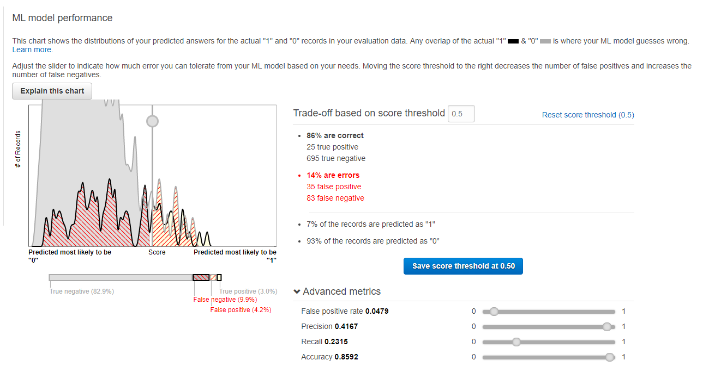
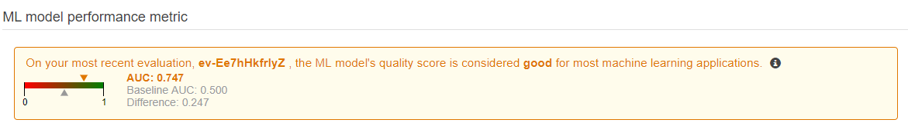

<heading> <b> ML-EmployeeTurnoverPrediction </b> </heading>

The objective of this project was to build a machine learning model that predicts whether an employee is likely to leave the company or not.

The dataset was obtained from EllisDon's People and Culture department.

I first cleaned the data using a pythong script - "Datacleaning.py".

I have built two different types of models, one using Amazon Machine Learning and another using pandas and sklearn python libraries.

The evaluations from the Amazon Machine Learning model are as follows:    
</img>
   
</img>

My python model has an accuracy or approximately 82%, as shown in the console output below:    
</img>
